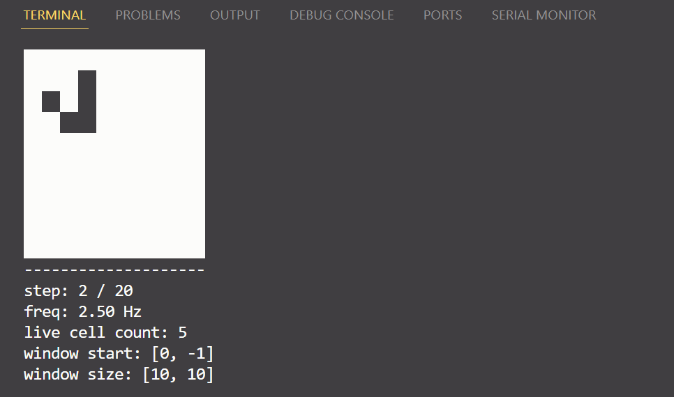
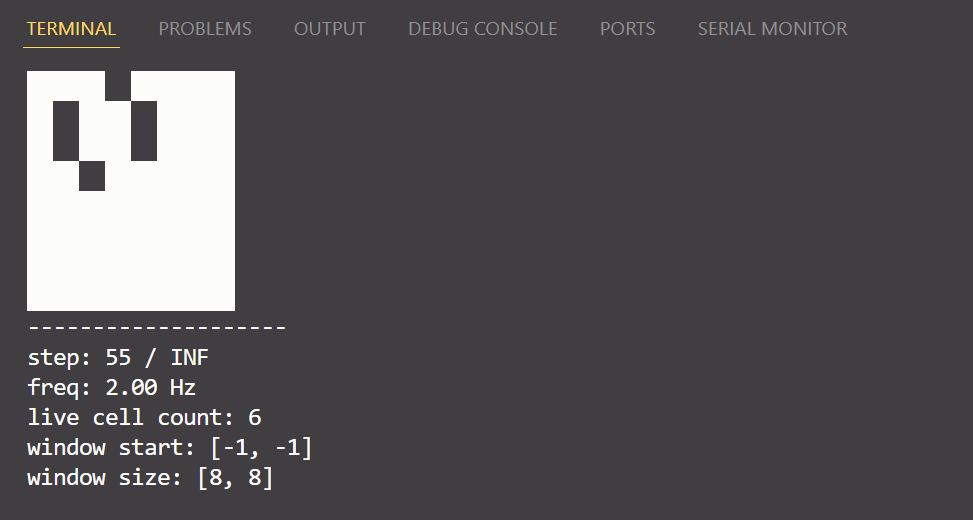
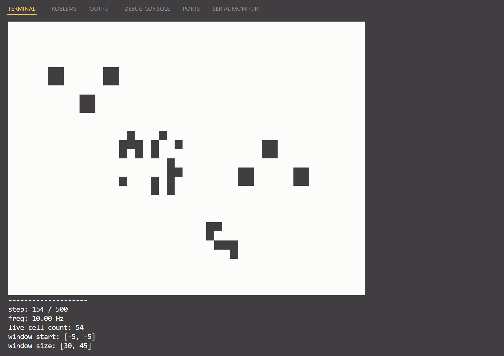

# Conway Game

Author: Ding Yang

Email: dingtc01@gmail.com

## Introduction

You can specify initial patterns, whether defined in source code or in data file, to start the game.

In source code, patterns below are defined:
1. glider
2. toad

In data file, patterns below are defined:
1. gosper glider gun
2. simkin glider gun


Multiple adjustable parameters are available when running the game, include:
- maximum running steps (-1 means infinite steps)
- interval between two frame
- x width and y width of the displaying window
- whether allow display window to dynamicly fit the universe or not

## How to Run

```
$ make all
$ ./bin/main
```

## Demo

### Glider

Display window position dynamically fit the cells, size fixed.

### Toad

Display window position and size both fixed.

### Gosper Glider Gun

Display window position and size both dynamically fit the cells.

### Simkin Glider Gun

Display window position and size both fixed.

## Code Structure

```
📂 project_root
├── 📂 data                // universe input and output
├── 📂 media               // screenshot or gif
├── 📂 src
│   ├── 📄 controller.cpp  // Control game logic and displayer
│   ├── 📄 controller.hpp 
│   ├── 📄 displayer.cpp   // How to display the game
│   ├── 📄 displayer.hpp 
│   ├── 📄 game_logic.cpp  // How the universe updates by game logic
│   ├── 📄 game_logic.hpp
│   ├── 📄 main.cpp        // Entrance
│   └── 📄 utils.hpp
├── 📄 Makefile
└── 📄 README.md
```